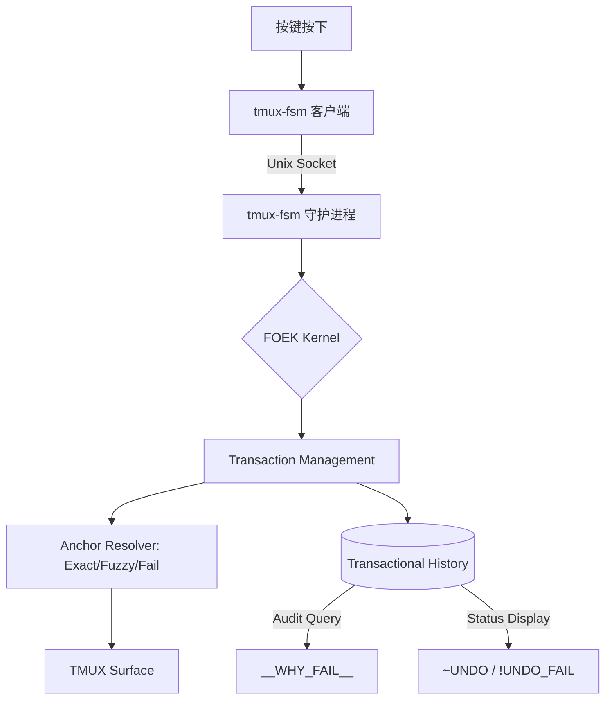
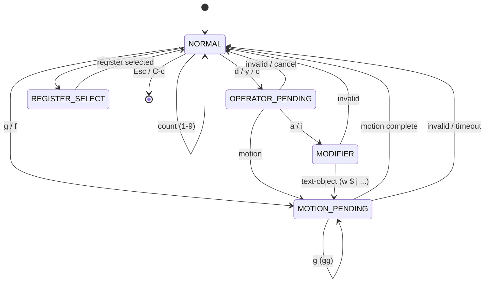

# Tmux-FSM
tmux‑fsm is a headless editing kernel running as a long‑lived daemon. tmux‑fsm does not edit text. It edits meaning over time.

# tmux-fsm: Fact-Oriented Editing Kernel (FOEK)

# tmux‑fsm

------

> **tmux‑fsm is not a tmux plugin.**

tmux‑fsm is a **headless editing kernel** running as a long‑lived daemon.  
tmux is merely its **TTY frontend** for input and display.

**This project is NOT for you if you want:**
- A drop‑in key binding collection  
- A stateless script that runs and exits  
- Something that stores its state in tmux options  
- “Just another tmux plugin”

tmux‑fsm **persists in memory**, **owns the state machine**, and **enforces its own timeline**.  
To tmux‑fsm, tmux is strictly a **dumb I/O device** — never the source of truth.

This architecture exists to enable things traditional tmux plugins cannot do:
semantic undo, spatial replay, multi‑step FSM reasoning, and sub‑millisecond reaction time.

If this sounds excessive, unfamiliar, or unnecessary —  
**you should stop reading here.**

—

### Who this project is for

tmux‑fsm is designed for users who:
- are comfortable running background daemons  
- understand client/server architectures  
- care about temporal continuity and state ownership  
- want an **editing kernel**, not a shortcut collection  

Everyone else will be happier with a conventional tmux plugin.


tmux‑fsm does not edit text.
It edits meaning over time.
--------

一个基于 **FOEK (事实导向编辑内核)** 理念的 tmux 模式插件。它不仅为 tmux 提供了 Vim 风格的导航，更在终端层面上实现了一套具备 **空间感 (Spatial Awareness)** 与 **时间线感 (Timeline Awareness)** 的编辑内核。

---

## 🌌 内核核心：FOEK (Fact-Oriented Editing Kernel)

tmux-fsm 不仅仅是一个插件，它是一个**高性能、常驻内存的编辑内核**，专注于三个核心领域：高性能响应、语义化一致性、以及**工业级安全性**。

### 为极致性能而生：Go Daemon 内核
- **服务端 (Daemon)**: 全 Go 编写，常驻内存，处理 FSM 状态转换与复杂逻辑。响应时间 **< 1ms**。
- **客户端 (Client)**: 极简二进制，仅负责通过 Unix Socket 发送按键，瞬间退出，零感知。

### 从“命令”到“事实”的飞跃
在 FOEK 中，编辑不是“按键的模拟”，而是“意图对空间事实的投影”。

- **Fact (事实)**：每个动作（删除、插入、修改）都被记录为一个具备精确范围（Range）和定位锚点（Anchor）的语义事实。
- **Transaction (事务)**：复合操作（如 `5dw`）被视为原子事务。撤销时要么完整还原，要么为了安全拒绝执行，绝不留下中间错误状态。
- **Anchor Resolver (定位引擎)**：撤销不再依赖光标位置，而是通过 **Exact -> Fuzzy -> Fail** 三层策略在面板中搜索文本。

---

## 🛡️ 工业级安全：撤销安全公理 (Undo Safety Axioms)

tmux-fsm 实现了目前终端插件中最先进的撤销保护机制。我们遵循一套严格的**撤销安全公理**：

1. **保护现场高于还原文本**：当环境发生剧烈变动（如 Shell Prompt 刷新或文本被外部篡改）导致无法 100% 确定位置时，系统会选择 **Safe Skip (安全跳过)**，并标记 `!UNDO_FAIL`。
2. **原子化一致性**：事务中任何一步由于安全原因无法执行，整个事务都会被标记为 `Skipped`，且禁止 Redo。
3. **模糊透明度**：当系统通过模糊匹配成功找回文本时，状态栏会显示 `~UNDO` 指示，告知用户当前环境已发生偏移。

### 诊断与审计 (Auditability)
系统不再是一个“黑盒”。如果撤销失败，您可以询问系统：
- **`p` 键 (__STATUS__)**：查看内核当前完整的事务栈。
- **`__WHY_FAIL__` 指令**：返回最近一次撤销失败的具体审计原因（例如：`Anchor mismatch due to Prompt detection`）。

---

## ✨ 魔法特性：Spatial Echo (空间回声)
**Spatial Echo** 是 FOEK 内核成熟后的第一次自然共振。它在无多光标、无新模式的前提下，实现了多点、可重放的编辑。

1. **Armed Facts (武装事实)**：执行如 `3dw` 的复合操作时，系统会生成 **3 个独立的 Range 事实** 并存入缓冲区。
2. **Global Apply (全局意图)**：按下 `g + 操作符`（如 `gd`, `g~`），内核会瞬间“瞬移”到所有武装锚点并重新执行编辑意图。

---

## 🛠 功能特性

- **Vim 风格导航**：`h/j/k/l`, `w/b/e`, `0/$`, `gg/G`, `f{char}`。
- **结构化操作符**：`d` (delete), `y` (yank), `c` (change), `v/V` (visual), `p/P` (paste)。
- **工业级 Undo/Redo**：基于事务和 Anchor Resolver 的原子化撤销系统。
- **文本对象**：支持 `aw`, `iw`, `i"`, `ap` 等高级语义操作。
- **寄存器系统**：26 个命名寄存器，支持追加模式，并与系统剪贴板实时同步。

---

## 📜 执行架构 (C/S 架构)



---

## 🚀 快速开始

### 安装

**依赖**：需要安装 [Go](https://go.dev/) (用于编译高性能内核)。

```bash
# 1. 克隆仓库并编译安装
./install.sh
```

安装脚本会自动：
- 编译 Go 二进制文件 (FOEK Kernel)
- 部署插件到 `~/.tmux/plugins/tmux-fsm`
- 自动在 `~/.tmux.conf` 中配置加载项并重新加载

### 基础操作

- **进入/退出**：`<prefix> f` 进入，`Esc` 退出。
- **工业级撤销**：`u` (Undo), `C-r` (Redo)。
- **空间回声**：执行 `3dw` 后，在任意位置按 `gd` 即可触发全局回声。
- **文本对象**：`diw` (删除词内), `ci"` (修改引号内)。
- **诊断失败**：输入 `__WHY_FAIL__` 查询最后一次撤销被拒的原因。

---

## 许可证

本项目遵循 **FOEK 内核宣言**，采用 MIT License 授权。

> _“我们不只是在模拟 Vim，我们是在隔离终端的复杂性。”_

---

## 卸载

```bash
rm -rf ~/.tmux/plugins/tmux-fsm
```

并从 tmux 配置文件中删除：

```
source-file "$HOME/.tmux/plugins/tmux-fsm/plugin.tmux"
```

---

## 故障排除

1. **确保已安装 Go**：编译内核需要 Go 环境。
2. **确认 Socket 状态**：守护进程会在 `~/.tmux-fsm.sock` 创建连接点。
3. **重新加载配置**：
   ```bash
   tmux source-file ~/.tmux.conf
   ```
4. **手动停止/重启服务端**：
   ```bash
   pkill -f "tmux-fsm -server"
   ```
4. 如果有问题，可在 tmux 中查看错误信息：
   ```bash
   tmux show-messages
   ```

---

---

# FSM 状态转移图（FSM Diagram）

## 1️⃣ 总览（高层 FSM）



---

## 2️⃣ 各状态说明（和代码一一对应）

### 🟢 NORMAL

**默认状态**

- 等待：
  - 操作符：`d y c`
  - 移动命令：`h j k l w b e 0 $ G`
  - 前缀数字：`1-9`
  - 特殊前缀：`g`、`f`
  - 寄存器选择：`"`

特点：

- 所有命令的 **起点**
- 可直接执行 _纯移动_
- 可累计数字前缀

---

### 🟡 OPERATOR_PENDING

**操作符等待状态**

由以下进入：

- `d`（delete）
- `y`（yank）
- `c`（change）

等待：

- 一个 **motion**
- 或 **modifier**（`a` / `i`）

示例：

- `d` → OPERATOR_PENDING
- `dw` → 执行 delete(word)
- `diw` → delete(inside word)

---

### 🔵 MOTION_PENDING

**需要更多按键的移动命令**

典型场景：

- `g` → 等待第二个 `g`
- `f` → 等待目标字符

示例：

- `g` → MOTION_PENDING
- `gg` → goto top
- `f a` → find next `a`

---

### 🟣 MODIFIER

**文本对象修饰符**

进入方式：

- 在 OPERATOR_PENDING 后输入：
  - `a`（around）
  - `i`（inside）

等待：

- 一个 motion / text-object

示例：

- `diw`
- `yaw`
- `ci"`

---

### 🟠 REGISTER_SELECT

**寄存器选择状态**

进入方式：

- 输入 `"`

等待：

- 寄存器名：
  - `a-z`
  - `A-Z`（追加）
  - `0-9`
  - `+`（系统剪贴板）

示例：

- `"a yw`
- `"A dw`
- `"+p`

---

## 3️⃣ 典型命令的 FSM 路径示例

### ✅ `3dw`

```
NORMAL
 → (3) count
 → d → OPERATOR_PENDING
 → w → execute(delete, word, count=3)
 → NORMAL
```

---

### ✅ `"a y2w`

```
NORMAL
 → " → REGISTER_SELECT
 → a → NORMAL (register=a)
 → y → OPERATOR_PENDING
 → 2 → count
 → w → execute(yank, word, count=2, register=a)
 → NORMAL
```

---

### ✅ `gg`

```
NORMAL
 → g → MOTION_PENDING
 → g → execute(goto_top)
 → NORMAL
```

---

## 4️⃣ 设计亮点（可以直接写进 README）

> tmux-fsm 使用 **显式 FSM 状态建模**，而不是 tmux key-table 级联：
>
> - ✅ 避免 key table 组合爆炸
> - ✅ Vim 风格操作符-动作模型天然表达
> - ✅ 新命令 = 新状态或新转移，不影响已有逻辑
> - ✅ 所有按键路径 **可视化、可推理、可测试**
